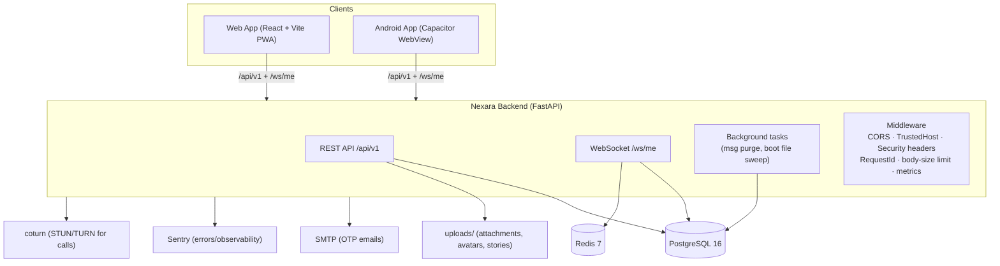
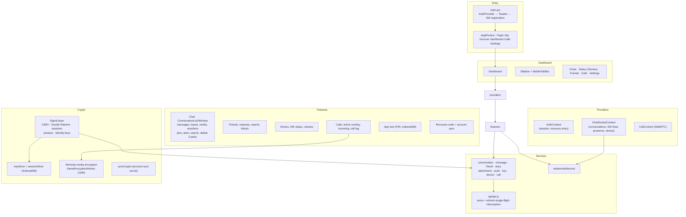
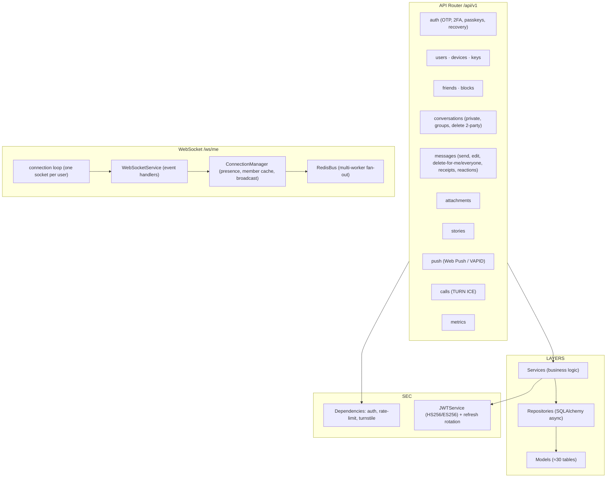
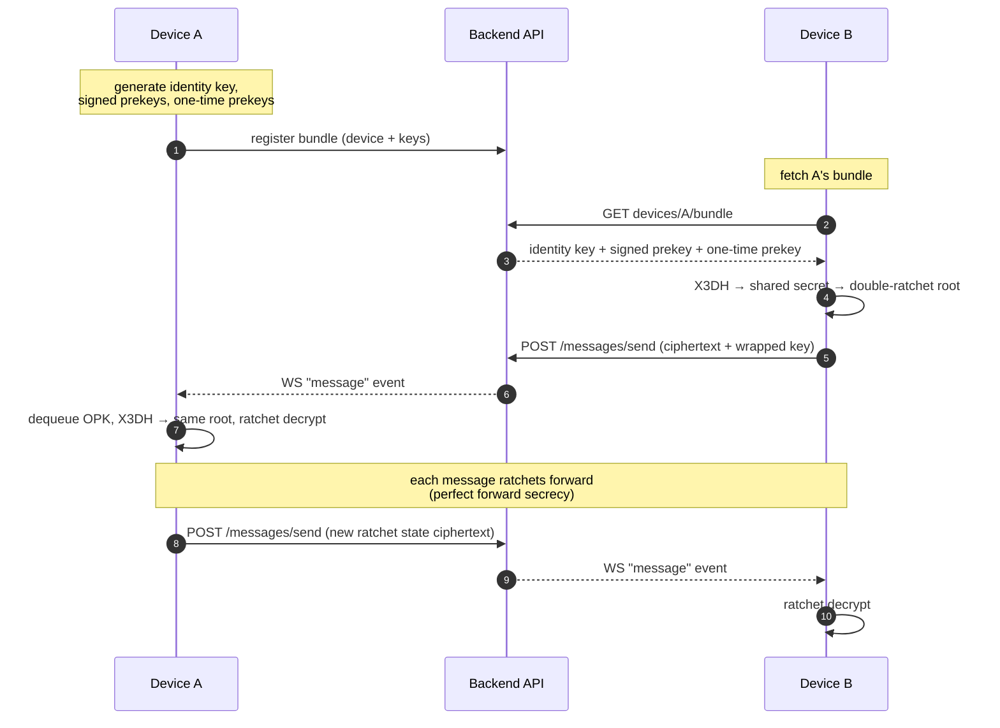
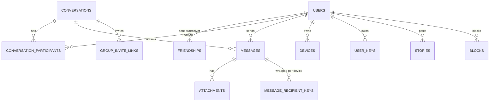
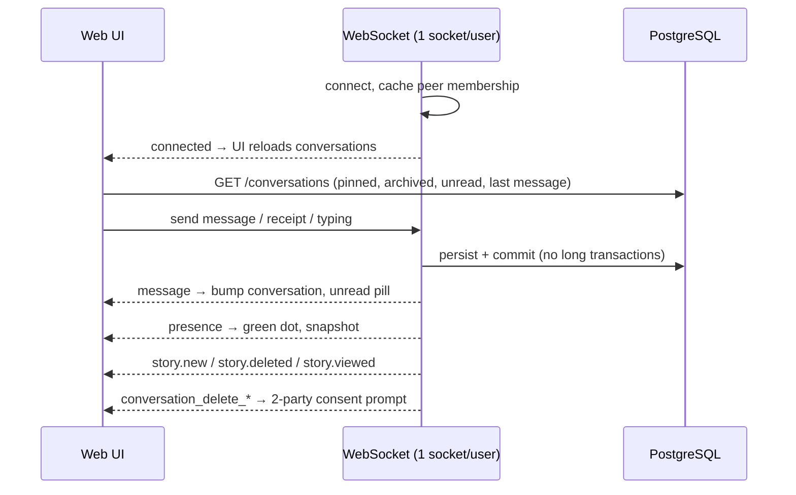
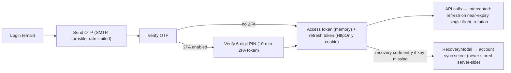

# Nexara — Graphical Memory

A visual map of the Nexara monorepo. Diagrams render on GitHub and in VS Code (Mermaid).

---

## 1. Runtime Topology

---

## 2. Frontend Map (frontend/src)

---

## 3. Backend Map (backend/app)

---

## 4. End-to-End Encryption (Signal Protocol)

- Server **never** sees plaintext: it stores ciphertext, wrapped AES keys, nonce, envelopes.
- Session keys live only in device `IndexedDB`; group chats re-wrap a fresh AES message-key per member (RSA + multi-device keys).

---

## 5. Data Model (core)

---

## 6. Real-Time Event Flow (sidebar stays live)

Background purge loop hard-deletes expired messages every 60s and broadcasts `message_purged`.

---

## 7. Auth & Session Flow

---

_Generated 2026-09-12. Update this file when architecture changes._