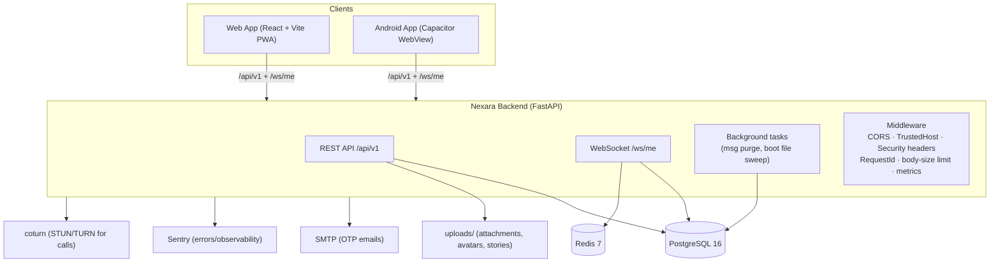
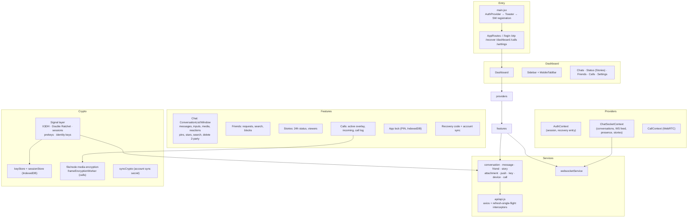
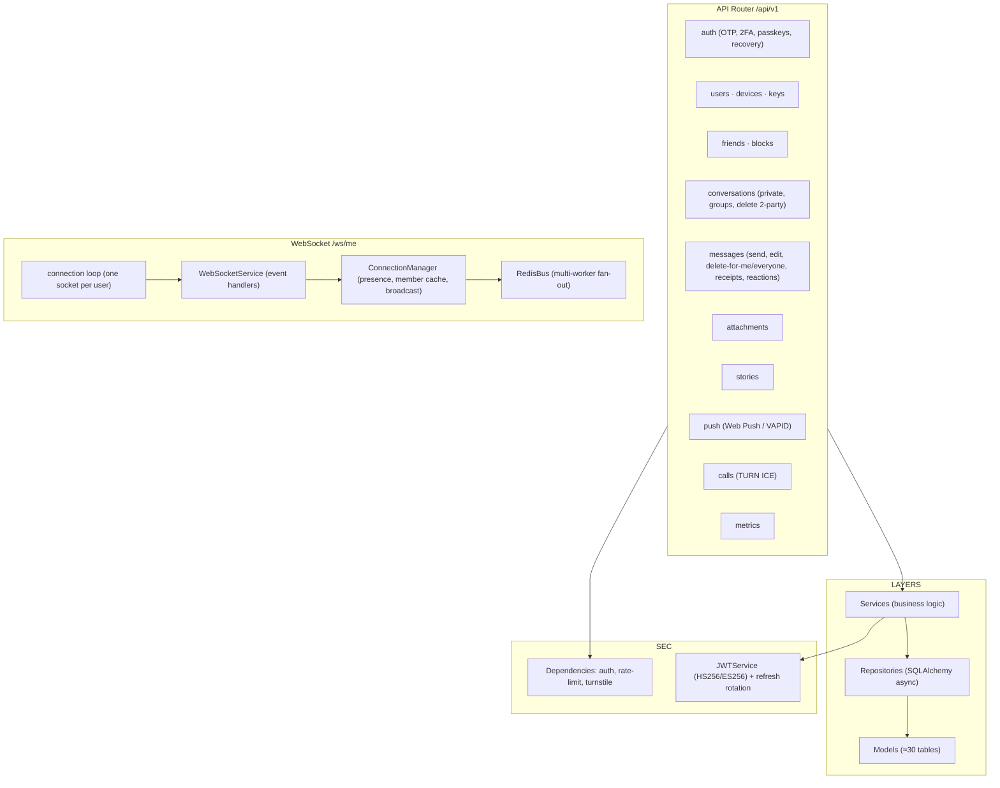
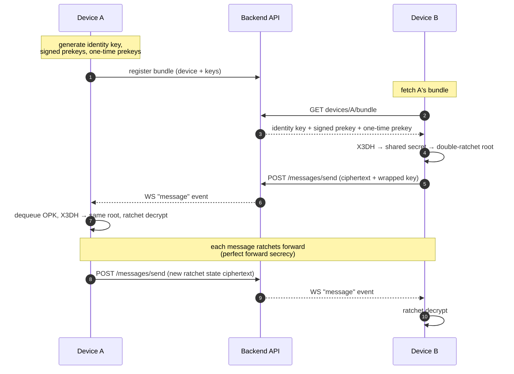
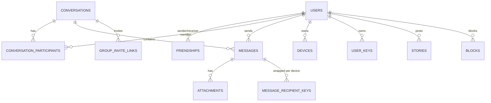
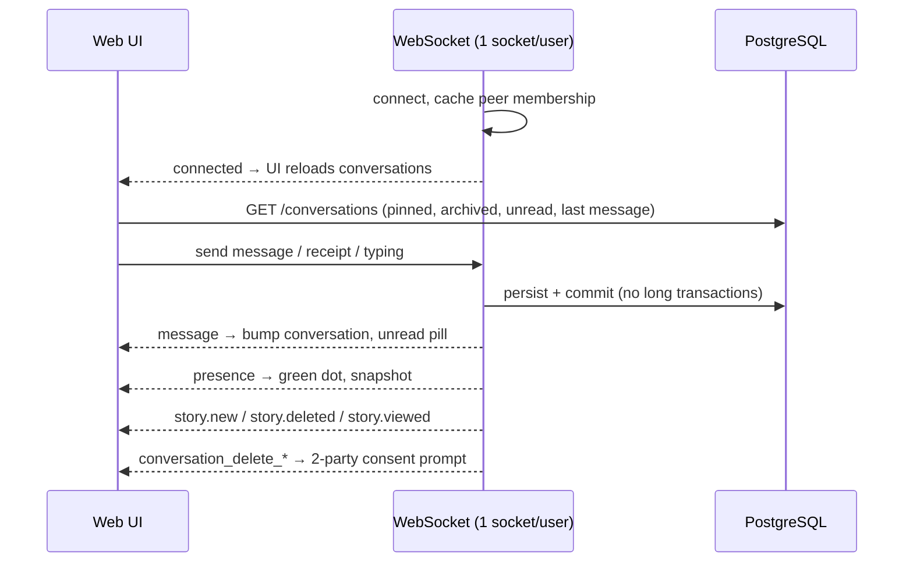
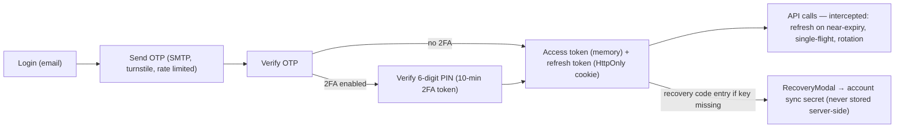
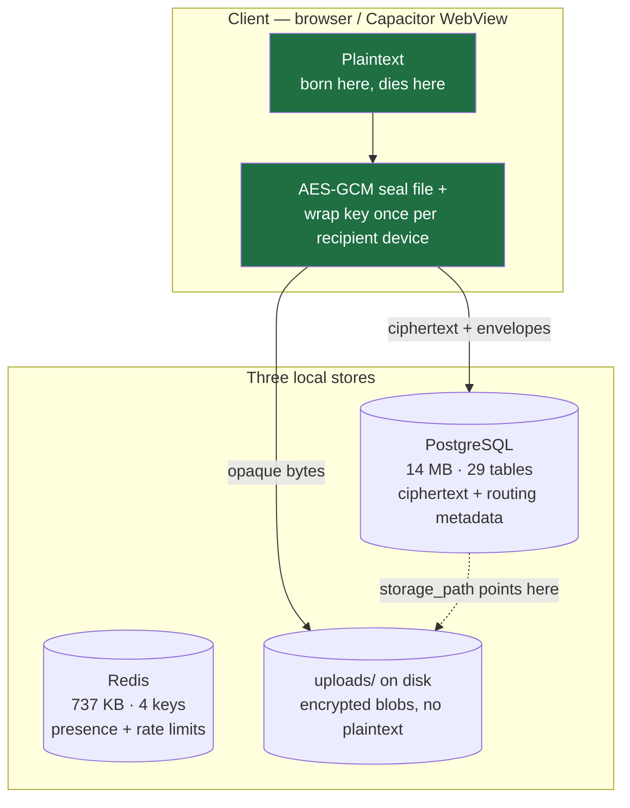
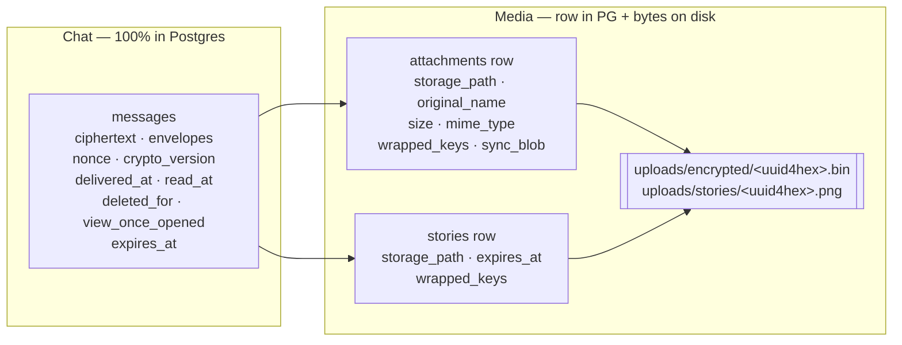
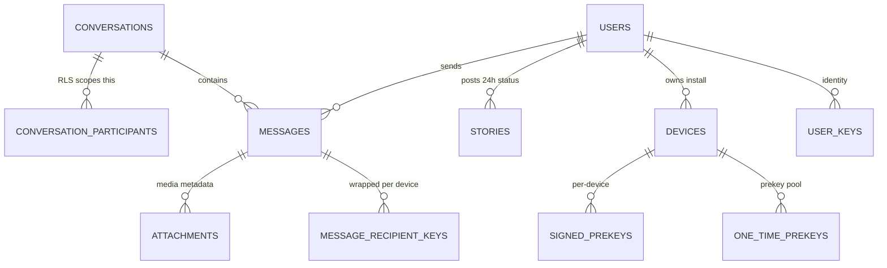

# Nexara — Graphical Memory

A visual map of the Nexara monorepo. Diagrams render on GitHub and in VS Code (Mermaid).

---

## 1. Runtime Topology


```mermaid
flowchart TB
    subgraph Clients
        PWA["Web App (React + Vite PWA)"]
        ANDROID["Android App (Capacitor WebView)"]
    end

    subgraph Backend["Nexara Backend (FastAPI)"]
        REST["REST API /api/v1"]
        WS["WebSocket /ws/me"]
        BGT["Background tasks<br/>(msg purge, boot file sweep)"]
        MID["Middleware<br/>CORS · TrustedHost · Security headers<br/>RequestId · body-size limit · metrics"]
    end

    PG[("PostgreSQL 16")]
    REDIS[("Redis 7")]
    FS["uploads/ (attachments, avatars, stories)"]
    TURN["coturn (STUN/TURN for calls)"]
    SMTP["SMTP (OTP emails)"]
    SENTRY["Sentry (errors/observability)"]

    PWA -->|"/api/v1 + /ws/me"| Backend
    ANDROID -->|"/api/v1 + /ws/me"| Backend
    REST --> PG
    WS --> PG
    WS --> REDIS
    BGT --> PG
    REST --> FS
    Backend --> SMTP
    Backend --> SENTRY
    Backend --> TURN
```

---

## 2. Frontend Map (frontend/src)


```mermaid
flowchart TB
    subgraph Entry
        main["main.jsx<br/>AuthProvider → Toaster → SW registration"]
        routes["AppRoutes: / /login /otp /recover /dashboard /calls /settings"]
    end

    subgraph Dashboard
        dash["Dashboard"]
        side["Sidebar + MobileTabBar"]
        tabs["Chats · Status (Stories) · Friends · Calls · Settings"]
    end

    subgraph Providers
        auth["AuthContext<br/>(session, recovery entry)"]
        chat["ChatSocketContext<br/>(conversations, WS feed, presence, stories)"]
        call["CallContext (WebRTC)"]
    end

    subgraph Features
        chatUI["Chat: ConversationList/Window<br/>messages, inputs, media, reactions<br/>pins, stars, search, delete 2-party"]
        friendsUI["Friends: requests, search, blocks"]
        storyUI["Stories: 24h status, viewers"]
        callUI["Calls: active overlay, incoming, call log"]
        lockUI["App lock (PIN, IndexedDB)"]
        recoverUI["Recovery code + account sync"]
    end

    subgraph Services
        api["api/api.js<br/>axios + refresh-single-flight interceptors"]
        svc["conversation · message · friend · story<br/>attachment · push · key · device · call"]
        ws["websocketService"]
    end

    subgraph Crypto
        signal["Signal layer<br/>X3DH · Double Ratchet · sessions<br/>prekeys · identity keys"]
        store["keyStore + sessionStore (IndexedDB)"]
        media["file/node media encryption<br/>frameEncryptionWorker (calls)"]
        sync["syncCrypto (account sync secret)"]
    end

    main --> routes
    routes --> dash
    dash --> providers
    providers --> features
    features --> svc
    features --> ws
    svc --> api
    chat --> ws
    signal --> svc
    signal --> store
    callUI --> media
```

---

## 3. Backend Map (backend/app)


```mermaid
flowchart TB
    subgraph API["API Router /api/v1"]
        R_AUTH["auth (OTP, 2FA, passkeys, recovery)"]
        R_USERS["users · devices · keys"]
        R_FRIENDS["friends · blocks"]
        R_CONV["conversations (private, groups, delete 2-party)"]
        R_MSG["messages (send, edit, delete-for-me/everyone, receipts, reactions)"]
        R_ATT["attachments"]
        R_STORY["stories"]
        R_PUSH["push (Web Push / VAPID)"]
        R_CALL["calls (TURN ICE)"]
        R_OPS["metrics"]
    end

    subgraph WSLAYER["WebSocket /ws/me"]
        WS_MAIN["connection loop (one socket per user)"]
        WS_SVC["WebSocketService (event handlers)"]
        MGR["ConnectionManager (presence, member cache, broadcast)"]
        BUS["RedisBus (multi-worker fan-out)"]
    end

    subgraph LAYERS
        SVC["Services (business logic)"]
        REPO["Repositories (SQLAlchemy async)"]
        MODELS["Models (≈30 tables)"]
    end

    subgraph SEC
        DEP["Dependencies: auth, rate-limit, turnstile"]
        JWT["JWTService (HS256/ES256) + refresh rotation"]
    end

    API --> SVC
    WS_MAIN --> WS_SVC
    WS_SVC --> MGR
    MGR --> BUS
    SVC --> REPO
    REPO --> MODELS
    API --> DEP
    SVC --> JWT
```

---

## 4. End-to-End Encryption (Signal Protocol)


```mermaid
sequenceDiagram
    autonumber
    participant A as Device A
    participant API as Backend API
    participant B as Device B

    Note over A: generate identity key,<br/>signed prekeys, one-time prekeys
    A->>API: register bundle (device + keys)
    Note over B: fetch A's bundle
    B->>API: GET devices/A/bundle
    API-->>B: identity key + signed prekey + one-time prekey
    B->>B: X3DH → shared secret → double-ratchet root
    B->>API: POST /messages/send (ciphertext + wrapped key)
    API-->>A: WS "message" event
    A->>A: dequeue OPK, X3DH → same root, ratchet decrypt
    Note over A,B: each message ratchets forward<br/>(perfect forward secrecy)
    A->>API: POST /messages/send (new ratchet state ciphertext)
    API-->>B: WS "message" event
    B->>B: ratchet decrypt
```

- Server **never** sees plaintext: it stores ciphertext, wrapped AES keys, nonce, envelopes.
- Session keys live only in device `IndexedDB`; group chats re-wrap a fresh AES message-key per member (RSA + multi-device keys).

---

## 5. Data Model (core)


```mermaid
erDiagram
    USERS ||--o{ FRIENDSHIPS : "sender/receiver"
    USERS ||--o{ CONVERSATION_PARTICIPANTS : "member"
    CONVERSATIONS ||--o{ CONVERSATION_PARTICIPANTS : "has"
    CONVERSATIONS ||--o{ MESSAGES : "contains"
    USERS ||--o{ MESSAGES : "sends"
    MESSAGES ||--o{ ATTACHMENTS : "has"
    MESSAGES ||--o{ MESSAGE_RECIPIENT_KEYS : "wrapped per device"
    USERS ||--o{ DEVICES : "owns"
    USERS ||--o{ USER_KEYS : "owns"
    USERS ||--o{ STORIES : "posts"
    CONVERSATIONS ||--o{ GROUP_INVITE_LINKS : "invites"
    USERS ||--o{ BLOCKS : "blocks"
```

---

## 6. Real-Time Event Flow (sidebar stays live)


```mermaid
sequenceDiagram
    participant UI as Web UI
    participant WS as WebSocket (1 socket/user)
    participant PG as PostgreSQL

    WS->>WS: connect, cache peer membership
    WS-->>UI: connected → UI reloads conversations
    UI->>PG: GET /conversations (pinned, archived, unread, last message)
    UI->>WS: send message / receipt / typing
    WS->>PG: persist + commit (no long transactions)
    WS-->>UI: message → bump conversation, unread pill
    WS-->>UI: presence → green dot, snapshot
    WS-->>UI: story.new / story.deleted / story.viewed
    WS-->>UI: conversation_delete_* → 2-party consent prompt
```

Background purge loop hard-deletes expired messages every 60s and broadcasts `message_purged`.

---

## 7. Auth & Session Flow


```mermaid
flowchart LR
    L["Login (email)"] --> O["Send OTP (SMTP, turnstile, rate limited)"]
    O --> V["Verify OTP"]
    V -->|2FA enabled| P["Verify 6-digit PIN (10-min 2FA token)"]
    V -->|no 2FA| T
    P --> T["Access token (memory) + refresh token (HttpOnly cookie)"]
    T --> R["API calls — intercepted: refresh on near-expiry, single-flight, rotation"]
    T -->|"recovery code entry if key missing"| RC["RecoveryModal → account sync secret (never stored server-side)"]
```

---

## 8. Where Data Actually Lives

Nothing is sharded or distributed. One Postgres, one Redis, one local disk folder.


```mermaid
flowchart TB
    subgraph CLIENT["Client — browser / Capacitor WebView"]
        PLAIN["Plaintext<br/>born here, dies here"]
        SEAL["AES-GCM seal file +<br/>wrap key once per recipient device"]
    end

    subgraph STORES["Three local stores"]
        PG[("PostgreSQL<br/>14 MB · 29 tables<br/>ciphertext + routing metadata")]
        RD[("Redis<br/>737 KB · 4 keys<br/>presence + rate limits")]
        DS[("uploads/ on disk<br/>encrypted blobs, no plaintext")]
    end

    PLAIN --> SEAL
    SEAL -->|"ciphertext + envelopes"| PG
    SEAL -->|"opaque bytes"| DS
    PG -.->|"storage_path points here"| DS

    style PLAIN fill:#1f6f43,color:#fff
    style SEAL fill:#1f6f43,color:#fff
```

**The rule:** Postgres stores ciphertext plus the keys needed to route it. Disk stores encrypted blobs. Neither ever holds plaintext.

| Store | Size | Contents | Durable? |
|---|---|---|---|
| PostgreSQL `nexara` | 14 MB | all 29 tables — ciphertext, envelopes, keys, metadata | source of truth |
| Redis | 737 KB | `nexara:ws:online:*` presence (TTL ~88s), `rl:*` rate limits | no, disposable |
| `uploads/` disk | 0 B | 10 auto-created dirs, media blobs only | yes, but **orphans** on crash |
| coturn | — | WebRTC relay; call media never reaches the app server | no |

Redis holds 4 keys at rest. If you lose it, nothing is lost — only presence dots and rate-limit counters reset.

---

## 9. Chat vs Attachment Storage

Chats live **inside** Postgres. Attachments and stories are a **split**: a Postgres row pointing at a disk file.


```mermaid
flowchart LR
    subgraph CHAT["Chat — 100% in Postgres"]
        M["messages<br/>ciphertext · envelopes<br/>nonce · crypto_version<br/>delivered_at · read_at<br/>deleted_for · view_once_opened<br/>expires_at"]
    end

    subgraph MEDIA["Media — row in PG + bytes on disk"]
        A["attachments row<br/>storage_path · original_name<br/>size · mime_type<br/>wrapped_keys · sync_blob"]
        S["stories row<br/>storage_path · expires_at<br/>wrapped_keys"]
        F[["uploads/encrypted/&lt;uuid4hex&gt;.bin<br/>uploads/stories/&lt;uuid4hex&gt;.png"]]
    end

    M --> A
    M --> S
    A --> F
    S --> F
```

One `messages` row carries the body once in `ciphertext`, then the same plaintext re-wrapped **per recipient device** into `envelopes` (JSON). A user with 18 devices produces 18 wrapped keys on a single row.


```mermaid
erDiagram
    CONVERSATIONS ||--o{ CONVERSATION_PARTICIPANTS : "RLS scopes this"
    CONVERSATIONS ||--o{ MESSAGES : "contains"
    MESSAGES ||--o{ ATTACHMENTS : "media metadata"
    MESSAGES ||--o{ MESSAGE_RECIPIENT_KEYS : "wrapped per device"
    USERS ||--o{ MESSAGES : "sends"
    USERS ||--o{ STORIES : "posts 24h status"
    USERS ||--o{ DEVICES : "owns install"
    DEVICES ||--o{ SIGNED_PREKEYS : "per-device"
    DEVICES ||--o{ ONE_TIME_PREKEYS : "prekey pool"
    USERS ||--o{ USER_KEYS : "identity"
```

Row-level security is the actual access boundary. Exactly 3 tables have RLS on — `messages`, `attachments`, `conversation_participants` — enforced by the `secure` schema:

```sql
current_setting('app.current_user_id') = 'system'
  OR secure.is_conversation_member(conversation_id, current_setting('app.current_user_id'))
```

Attachments are scoped *through* their parent message's conversation. The GUC is republished on every `after_begin` (database.py:64-73), so Postgres rejects cross-conversation reads even if application code slips. The `secure` schema holds 2 functions and **0 tables** — no data lives outside `public`.

### Live row counts

| Table | Rows | Table | Rows |
|---|---|---|---|
| `one_time_prekeys` | 8468 | `friendships` | 54 |
| `refresh_tokens` | 689 | `conversation_participants` | 52 |
| `users` | 158 | `messages` | 43 |
| `devices` | 137 | `call_logs` | 13 |
| `signed_prekeys` | 137 | `message_reactions` | 3 |
| `user_keys` | 69 | **`attachments`** | **0** |
| | | `stories` | 0 |

`one_time_prekeys` is the largest table at 2.2 MB — X3DH burns a prekey per new session, so it grows fastest and is the one worth pruning.

---

_Generated 2026-09-12. Sections 8-9 added 2026-10-04 from live instance introspection. Update this file when architecture changes._
